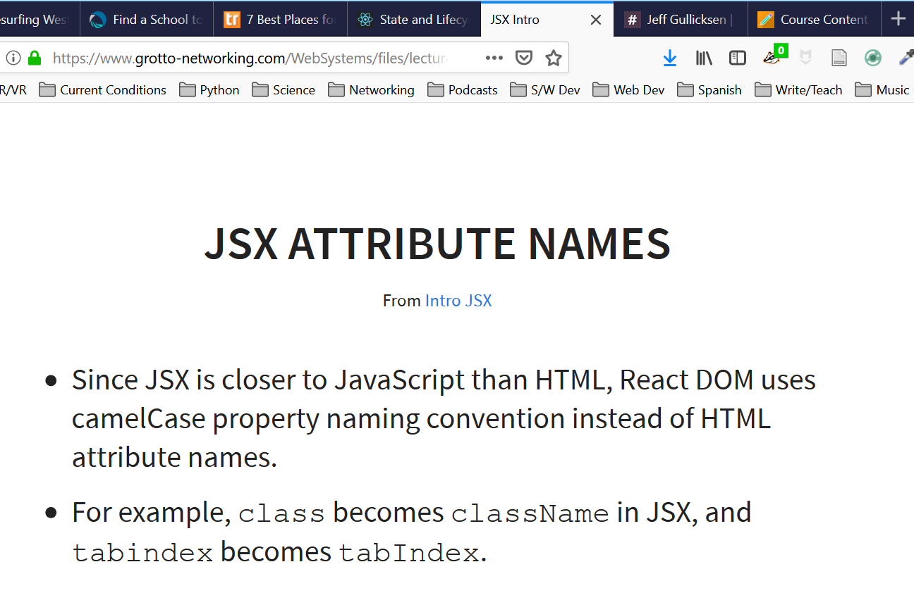

# Homework 8 CS651
**Justin Yeap**  
**NetID: mq5839**  

## Question 1

## (b)
There are 28127 files that take up about 290MB of space

## (c)
Inside the webpack-dev-server folder there is a package.json file that says one of the dependencies is express

## Question 2

This isn't the answer to question to but shows including a screen shot with Markdown.

## Question 3

Blah, *Blah*, **Blah**...
