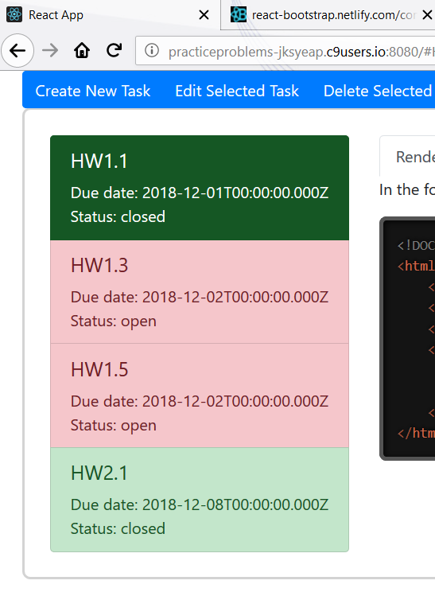
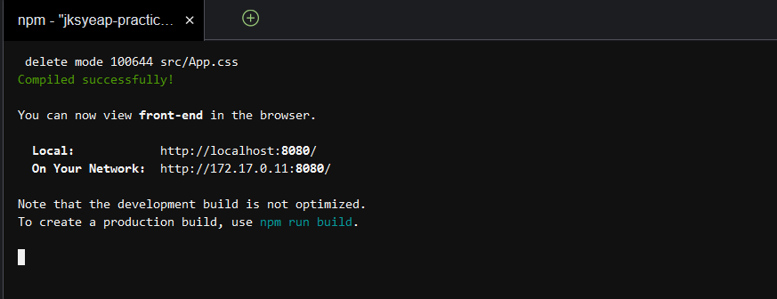
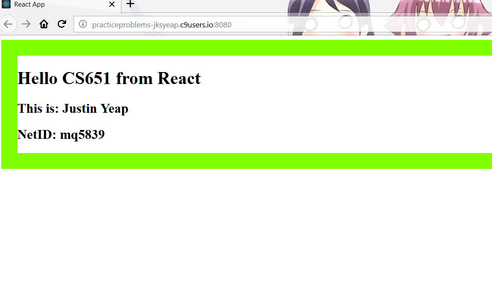
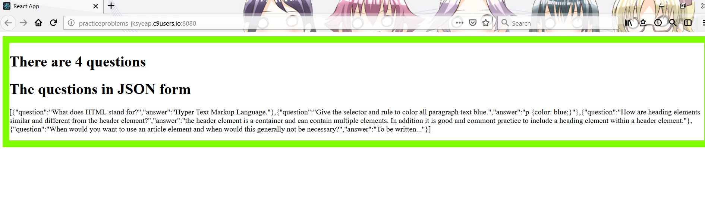

# Homework 8 CS651
**Justin Yeap**  
**NetID: mq5839**  

## Question 1
## (a)


## (b)
There are 28127 files that take up about 290MB of space  

## (c)
Inside the webpack-dev-server folder there is a package.json file that says one of the dependencies is express  

## Question 2
## (b)
 

## Question 3
## (a)
```javascript
import React from 'react';
import ReactDOM from 'react-dom';
import './index.css';
import qAndAs from './QandA.json';

const element = <div>
                  <h1>There are {qAndAs.length} questions</h1>
                  <div></div>
                  <h1>The questions in JSON form</h1>
                  <div></div>
                  <p>{JSON.stringify(qAndAs)}</p>
                </div>;

ReactDOM.render(element, document.getElementById('root'));
```

## (b)


## Question 4
## (a)
```javascript
class App extends React.Component {
  constructor(props) {
    super(props);
    this.state = {questions:qAndAs,
                  currentQuestionIndex:0,
                  showAnswer:false};
  }
  
  render() {
    let currentQuestion = this.state.questions[this.state.currentQuestionIndex];
    let panel = <QandAPanel showAnswer={this.state.showAnswer} 
                 question={currentQuestion.question} 
                 answer={currentQuestion.answer}/>;
    return <div>
            {panel}
           </div>;
  }
}
```

## (b)
```javascript
class QandAPanel extends React.Component {
  render() {
    if(this.props.showAnswer === false) {
      return <div>
              <h1>Test Yourself</h1>
              <h2>Question</h2>
              <p>{this.props.question}</p>
             </div>;
    }
    else {
      return <div>
              <h1>Test Yourself</h1>
              <h2>Question</h2>
              <p>{this.props.question}</p>
              <p>{this.props.answer}</p>
             </div>;
    }
  }
}
```

## Question 5
## (a)
Increment:  
```javascript
nextQuestion() {
  let inc = (this.state.currentQuestionIndex + 1) % this.state.questions.length;
  this.setState({currentQuestionIndex:inc});
}
```

Decrement:  
```javascript
prevQuestion() {
  let dec = this.state.currentQuestionIndex - 1;
  if(dec === -1) {dec = this.state.questions.length - 1;}
  this.setState({currentQuestionIndex:dec});
}
```

Toggle Answer:  
```javascript
toggleAnswer() {
  let show = !this.state.showAnswer;
  this.setState({showAnswer:show});
}
```

## (b)
```javascript
class ControlPanel extends React.Component {
  render() {
    return <div>
            <button onClick={this.props.nextQuestion}>Forward</button>
            <button onClick={this.props.prevQuestion}>Back</button>
            <button onClick={this.props.toggleAnswer}>{this.props.showAnswer ? 'Hide Answer' : 'Show Answer'}</button>
            <p>Question {this.props.currentQuestionIndex + 1} of {this.props.howManyQs}</p>
           </div>;
  }
}
```