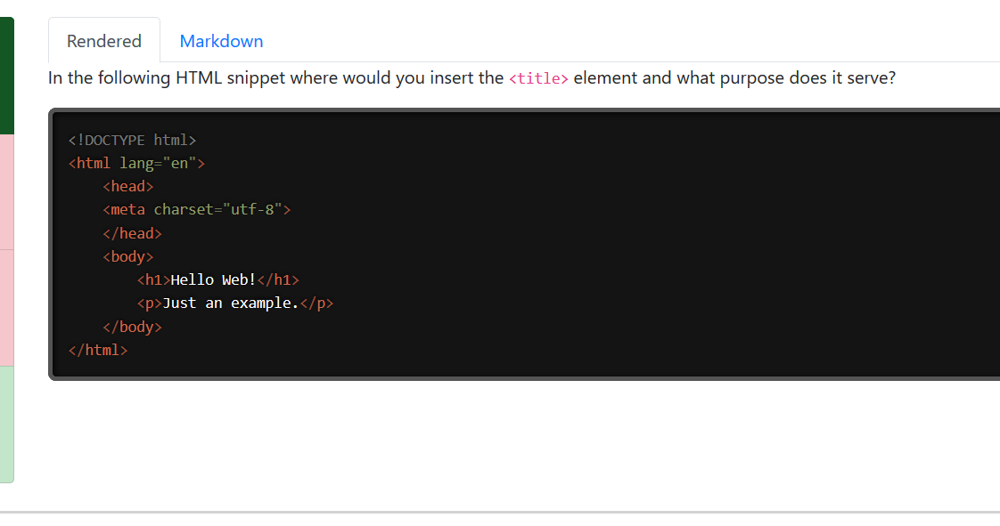
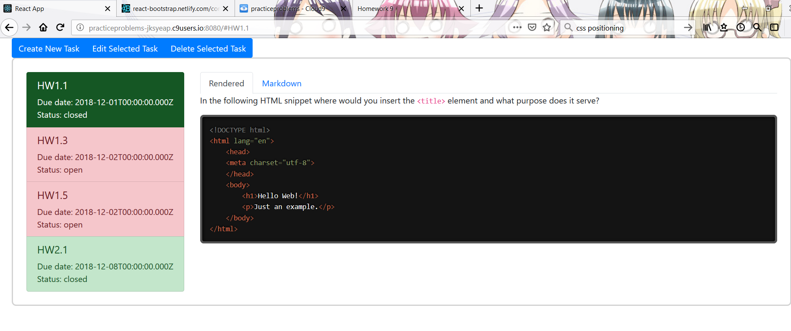
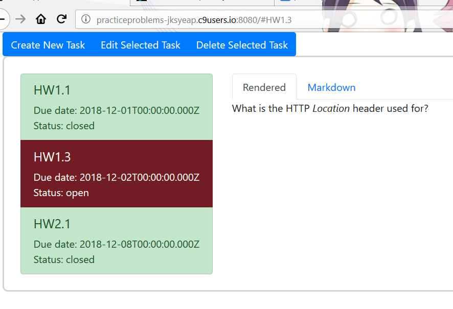
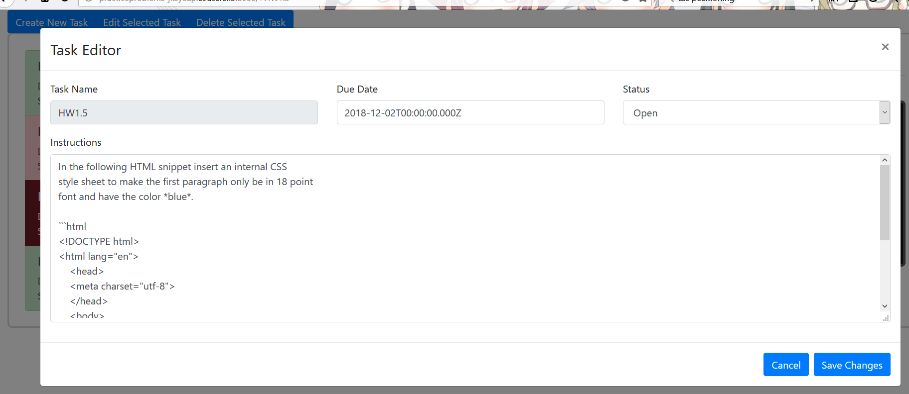
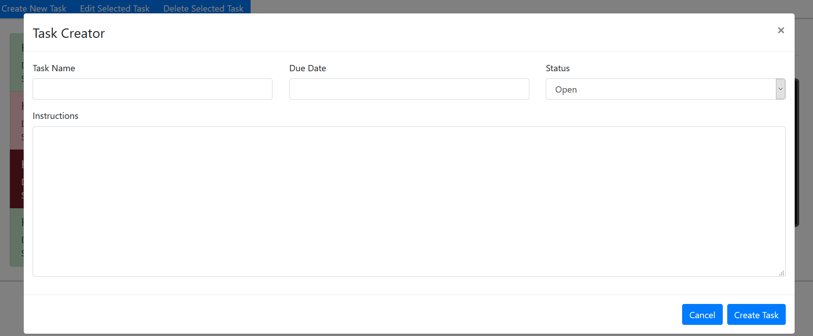
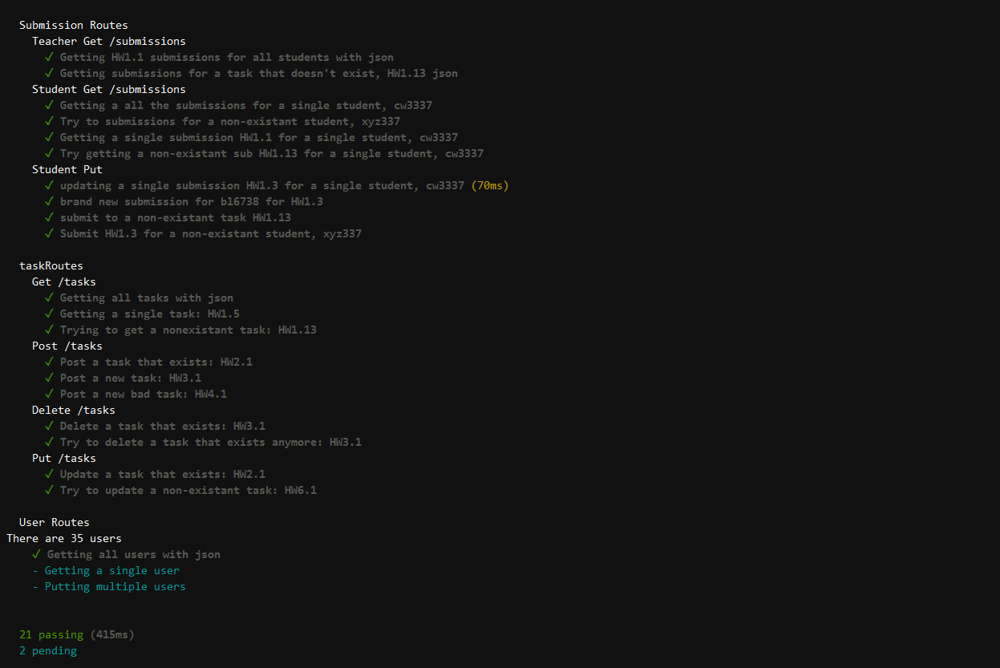

# Homework 9 CS651
**Justin Yeap**  
**NetID: mq5839**  

## Question 1
## (a)
```jsx
class TaskList extends React.Component {
  render() {
    let tasks = this.props.tasklist;
    let listItems = tasks.map(function(element) {
      if(element["status"] === "closed") {
        return <ListGroup.Item href={"#"+element["task-name"]} key={element["task-name"]} variant="success" action>
                 <h5>{element["task-name"]}</h5>
                 Due date: {element["due"]}<br/>
                 Status: {element["status"]}
               </ListGroup.Item>;
      }
      else {
        return <ListGroup.Item href={"#"+element["task-name"]} key={element["task-name"]} variant="danger" action>
                 <h5>{element["task-name"]}</h5>
                 Due date: {element["due"]}<br/>
                 Status: {element["status"]}
               </ListGroup.Item>;
      }
    });
    return <ListGroup>{listItems}</ListGroup>;
  }
}
```
  

## (b)
```jsx
class QuestionPane extends React.Component {
  render() {
    let instructions = this.props.tasklist;
    let items = instructions.map(function(element) {
      let parsed = reader.parse(element["instructions"]);
      let result = writer.render(parsed);
      return <Tab.Pane eventKey={"#"+element["task-name"]} key={element["task-name"]}>
               <Tabs defaultActiveKey="rendered">
                 <Tab eventKey="rendered" title="Rendered"><div dangerouslySetInnerHTML={{__html:result}}></div></Tab>
                 <Tab eventKey="raw" title="Markdown">
                   <textarea className="raw" value={element["instructions"]} readOnly/>
                 </Tab>
               </Tabs>
             </Tab.Pane>;
    });
    return <Tab.Content>{items}</Tab.Content>;
  }
}
```


## (c)
There is a top level component called APR.js that holds the state and is a tab container. Under that component there is  
a component called TaskList.js that lists the tasks in a listgroup, each listgroup item is a clickable tab button and 
brings up the task instructions in a corresponding tab pane. The tab panes are defined in the QuestionPane.js component. 
Inside the tab pane from QuestionPane.js is another "Tabs" element in which one tab shows the rendered instructions, and  
the other tab shows raw markdown.
  
  


## (d)


## (e)
Clicking on the "Edit Selected Task" button brings up a modal window component defined in TaskEditor.js. It's controlled by
the state variable _showEditor_. The modal window has a form in the body that allows editing of the date, status, and  
instructions.
  


## (f)
Clicking on the "Create New Task" button brings up a modal window component that is another instance of TaskEditor.js, but  
this time its props are set to allow creating a new task. Therefore this modal window also has a form in the body that  
allows editing date, status, instructions, and name.  
  


## Question 2
## (a)
  
  

## (b)
This line added to package.json:  
```json
"proxy": "http://0.0.0.0:8080"
```

## (c)
This is the initial fetch call that gets the list of tasks from the server when the app starts:  
```jsx
componentDidMount() {
  let self = this;
  fetch('/tasks',{method:'GET'}).then(response => response.json())
    .then(function(data) {
      self.setState({tasklist:data.tasks});
      Prism.highlightAll();
  });
}
```
Initially the list of tasks in the state variable is empty, but after this call it gets populated with  
tasks from the server. 

## (d)
This is the method that updates a task. When the corresponding button is clicked, it sends a fetch.put call  
to the server at /tasks/:taskname with the updated task object in the body. If the server successfully updated 
the task, then the local copy of the task in this.state.tasklist is updated as well.  
```jsx
saveChanges() {
  let self = this;
  let updatedTask = Object.assign({},this.state.currentTaskObj);
  delete updatedTask['_id'];
  fetch("/tasks/"+self.state.currentTask,{method:'PUT', headers:{"Content-Type":"application/json"}, body:JSON.stringify(updatedTask)})
  .then(function(response) {
    if(response.status === 200) {
      let tasksCopy = self.state.tasklist;
      let currentTask = self.state.currentTask;
      let updatedTaskIndex = self.state.tasklist.findIndex(function(element) {
        return element["task-name"] === currentTask;
      });
      tasksCopy[updatedTaskIndex] = Object.assign(tasksCopy[updatedTaskIndex],updatedTask);
      self.setState({tasklist:tasksCopy, currentInstruction:self.state.currentInstruction});
    }
    else
      console.log("Failed to update task");
  });
}
```

## (e)
This is the method that creates a task. When the corresponding button is clicked, it sends a fetch.post call  
to the server at /tasks with the newly created task object in the body. If the server successfully inserted 
the new task, then the new task is added locally to this.state.tasklist as well. 
```jsx
createTask() {
  if(this.state.newTask["task-name"] === "" || this.state.newTask["due"] === "") 
    return;
  let self = this;
  fetch('/tasks',{method:'POST',headers:{"Content-Type":"application/json"}, body:JSON.stringify(self.state.newTask)})
  .then(function(response) {
    if(response.status === 201) {
      let tasksCopy = self.state.tasklist;
      let temp = Object.assign({},blankTask);
      tasksCopy.push(self.state.newTask);
      self.setState({tasklist:tasksCopy, newTask:temp});
      Prism.highlightAll();
    }
    else
      console.log("Failed to create task");
    
  });
}
```

## (f)
This is the method that deletes a task. When the corresponding button is clicked, it sends a fetch.delete call  
to the server at /tasks/:taskname. If the server successfully deleted the task, then the local copy of the task 
in this.state.tasklist is deleted as well.  
```jsx
deleteTask() {
  let self = this;
  fetch("/tasks/"+self.state.currentTask,{method:'DELETE'}).then(response => response.json())
  .then(function(data) {
    if(data.success === true) {
      let temp = self.state.tasklist;
      let currentTask = self.state.currentTask;
      temp = temp.filter(function(element) {
        if(element["task-name"] === currentTask)
          return false;
        else
          return true;
      });
      self.setState({tasklist:temp, currentTask:"", currentInstruction:""});
    }
    else
      console.log("Failed to delete task");
  });
}
```
