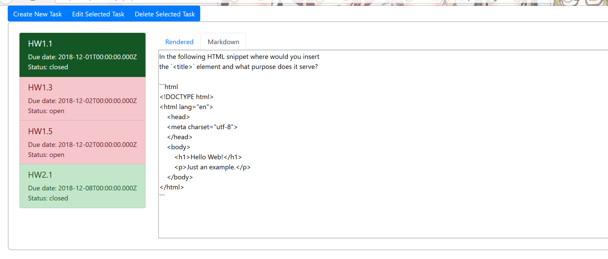
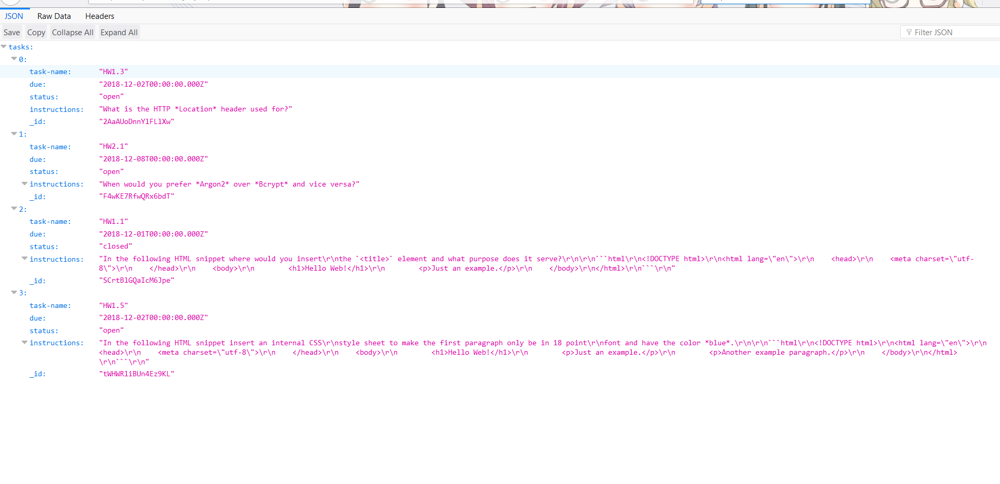

# Homework 9 CS651
**Justin Yeap**  
**NetID: mq5839**  

## Question 1
## (a)
```jsx
class TaskList extends React.Component {
  render() {
    let tasks = this.props.tasklist;
    let listItems = tasks.map(function(element) {
      if(element["status"] === "closed") {
        return <ListGroup.Item href={"#"+element["task-name"]} key={element["task-name"]} variant="success" action>
                 <h5>{element["task-name"]}</h5>
                 Due date: {element["due"]}<br/>
                 Status: {element["status"]}
               </ListGroup.Item>;
      }
      else {
        return <ListGroup.Item href={"#"+element["task-name"]} key={element["task-name"]} variant="danger" action>
                 <h5>{element["task-name"]}</h5>
                 Due date: {element["due"]}<br/>
                 Status: {element["status"]}
               </ListGroup.Item>;
      }
    });
    return <ListGroup>{listItems}</ListGroup>;
  }
}
```
  

## (b)
```jsx
class QuestionPane extends React.Component {
  render() {
    let instructions = this.props.tasklist;
    let items = instructions.map(function(element) {
      let parsed = reader.parse(element["instructions"]);
      let result = writer.render(parsed);
      return <Tab.Pane eventKey={"#"+element["task-name"]} key={element["task-name"]}>
               <Tabs defaultActiveKey="rendered">
                 <Tab eventKey="rendered" title="Rendered"><div dangerouslySetInnerHTML={{__html:result}}></div></Tab>
                 <Tab eventKey="raw" title="Markdown">
                   <textarea className="raw" value={element["instructions"]} readOnly/>
                 </Tab>
               </Tabs>
             </Tab.Pane>;
    });
    return <Tab.Content>{items}</Tab.Content>;
  }
}
```


## (c)
There is a top level component called APR.js that holds the state and is a tab container. Under that component there is  
a component called TaskList.js that lists the tasks in a listgroup, each listgroup item is a clickable tab button and 
brings up the task instructions in a corresponding tab pane. The tab panes are defined in the QuestionPane.js component. 
Inside the tab pane from QuestionPane.js is another "Tabs" element in which one tab shows the rendered instructions, and  
the other tab shows raw markdown.
  
  


## (d)


## (e)
Clicking on the "Edit Selected Task" button brings up a modal window component defined in TaskEditor.js. It's controlled by
the state variable _showEditor_. The modal window has a form in the body that allows editing of the date, status, and  
instructions.
  


## (f)
Clicking on the "Create New Task" button brings up a modal window component that is another instance of TaskEditor.js, but  
this time its props are set to allow creating a new task. Therefore this modal window also has a form in the body that  
allows editing date, status, instructions, and name.  
  


## Question 2
## (a)
  
  

## (b)
This line added to package.json:  
```json
"proxy": "http://0.0.0.0:8080"
```